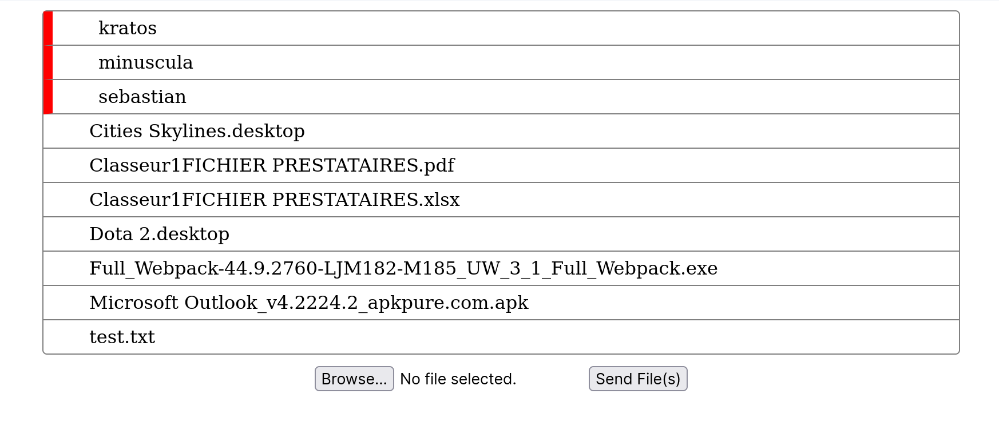

# Sharing Services API



A backend server API to handle ressources sharing in a network.
The server have been made in `NodeJs`.

## Installation & Usage

First and foremost, you must have `nodeJs` installed on your computer. Then type the following command in your terminal : 

```
git clone https://github.com/yayolande/sharingServicesAPI
cd sharingServicesAPI
npm start
```


